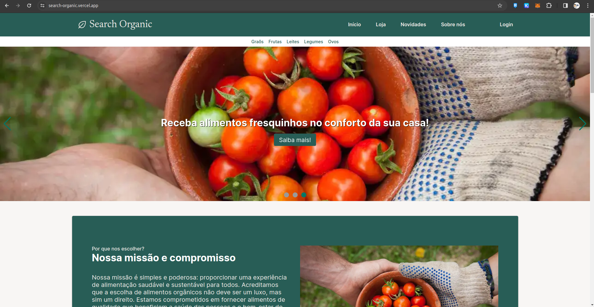

<h1 align="center"> Search Organic </h1>

<p align="center">
  Repositório referente ao desenvolvimento do front-end da aplicação Search Organic.<br/>
</p>

<p align="center">
  <a href="#-tecnologias">Tecnologias</a>&nbsp;&nbsp;&nbsp;|&nbsp;&nbsp;&nbsp;
    <a href="#-instalacao-do-projeto">Instalação do projeto</a>&nbsp;&nbsp;&nbsp;|&nbsp;&nbsp;&nbsp;
  <a href="#-sobre-o-projeto">Sobre o Projeto</a>&nbsp;&nbsp;&nbsp;
</p>

<p align="center">
  
</p>

<p align="center">
  <a href="https://search-organic.vercel.app/" target="_blank">➡️ Acesse o deploy!</a>
</p>

## 🚀 Tecnologias

Esse projeto foi desenvolvido com as seguintes tecnologias:

- React (CRA)
- TypeScript
- HTML
- CSS
- Sass
- Axios
- Swiper
- Yup
- React Hook Form
- Redux Toolkit

## ⚙️ Instalação do projeto

Passo-a-passo:

1. Clone o repositório através desse link:

```
https://github.com/danielangelo1/SearchOrganic
```

2. Execute os seguintes comandos:

```
npm i
npm start
```

<<<<<<< Updated upstream
3. Para utilizar a opção de cadastro e login, instale o JSON Server com os seguinte comando:

```
npm install -g json-server
```

4. Em seguinda crie um arquivo com o nome db.json, com a seguinte estrutura:

```
{
  "users": [
    {
      "name": "Jhon Doe",
      "email": "jhon.doe@email.com",
      "birthDate": "01/01/1900",
      "telephone": "12 34567-8910",
      "CPF": "123.456.789-01",
      "password": "12345678",
      "id": "1"
    },
  ]
}
```

5. Execute o servidor com o comando abaixo:

```
json-server --watch db.json --port 3001
```

## Endpoints

### Registro

- **POST** `/users`: Registra um novo usuário.

### Login

- **GET** `/users?email={email}&password={password}`: Autentica um usuário.

=======
>>>>>>> Stashed changes
## Validações

### Formulário de Registro

- Nome, Data de Nascimento, Telefone, CPF: Obrigatórios.
- Email: Obrigatório, formato válido.
- Senha: Obrigatória, mínimo 8 caracteres.
- Confirmação de Senha: Obrigatória, deve coincidir com a senha.

### Formulário de Login

- Email: Obrigatório, formato válido.
- Senha: Obrigatória.

## Notas

- A aplicação está utilizando a API desenvolvida pelo back-end para cadastro e login do usuário;
- As validações no frontend complementam, mas não substituem medidas de segurança no backend;
- Existem rotas protegidas, que concedem acesso apenas a pessoas logadas/autorizadas;
- A aplicação conta com o carregamento "preguiçoso/tardio" (lazy loading) para otimização da performance;
- Utilização do tabindex para aprimoramento de acessibilidade da aplicação para pessoas com deficiência (PCD).
- A aplicação conta com um estado global, sendo utilizado um reducer no login, para gerenciamento do usuário e token recebido da API.
- A próxima etapa é realizar o gerenciamento do estado do carrinho da aplicação utilizando o estado global implantado através do Redux.

## 💻 Sobre o Projeto

O Search Organic tem como objetivo conectar pequenos produtores com clientes que buscam alimentos frescos e orgânicos, para contribuir com o desenvolvimento sustentável, através das ODS, reduzindo o desperdício de alimentos, além de fomentar o comércio local, diminuir a distância do transporte dos alimentos e consequentemente diminuição do consumo de combustíveis fósseis.

- <a href="https://www.figma.com/file/g9EQCcdJltWSkpHUZFdRUR/Figma-basics?type=design&node-id=1669-162202&mode=design&t=UBhgAyNh8l16fcEh-0" target="_blank">➡️ Link para o Figma da aplicação!</a>

- Próximos passos:

Desenvolvimento do carrinho de comprar, página de detalhes do produto e perfil do usário.
